

    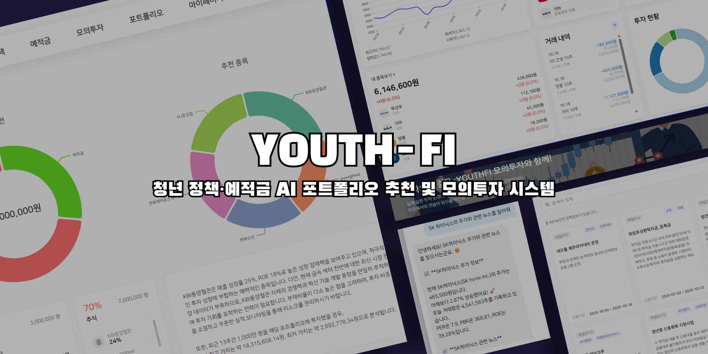
  

<header id="top">
  <h1 align="center">YouthFi — 청년 정책∙예적금 AI 포트폴리오 추천 및 모의투자 시스템</h1>

  

    
    
  

  
<em>금융에 대해 처음 공부하는 청년들을 대상으로 정책∙예적금 추천 및 실제 주가를 기반으로 하는 모의투자 시스템</em>

  
<em>투자 성향에 따른 AI 포트폴리오 추천 시스템</em>

  
<em>주가 정보, 기업 투자 분석, 금융지식 질문 등 RAG 기반 AI 챗봇 시스템</em>

</header>

<!-- 빠른 링크 -->
<nav id="links">
  

    <strong>GitHub</strong>
     
    <a href="https://github.com/KE-WhyNot" target="_blank" rel="noopener">https://github.com/KE-WhyNot</a>
      
    <strong>Swagger API</strong>
     
    <strong>AUTH</strong> <a href="https://auth.youth-fi.com/swagger-ui.html" target="_blank" rel="noopener">https://auth.youth-fi.com/swagger-ui.html</a>
     
    <strong>FINANCE</strong> <a href="https://finance.youth-fi.com/swagger-ui.html" target="_blank" rel="noopener">https://finance.youth-fi.com/swagger-ui.html</a>
     
    <strong>POLICY</strong> <a href="https://policy.youth-fi.com/docs#/" target="_blank" rel="noopener">https://policy.youth-fi.com/docs#/</a>
     
    <strong>NOTIFY</strong> <a href="https://notify.youth-fi.com/swagger-ui.html" target="_blank" rel="noopener">https://notify.youth-fi.com/swagger-ui.html</a>
  

<h3 align="center">📒 목차</h3>

  <a href="#intro">프로젝트 소개</a>
   | 
  <a href="#team">팀원 구성</a>
   | 
  <a href="#tech-stack">기술 스택</a>
   | 
  <a href="#repository">저장소·브랜치 전략·구조</a>
   | 
  <a href="#schedule">개발 기간·작업 관리</a>
   | 
  <a href="#quality-notes">신경 쓴 부분</a>
   | 
  <a href="#pages">페이지별 기능</a>
   | 
  <a href="#api">주요 API</a>

</nav>

<!-- 프로젝트 소개 -->
<section id="intro">
  <h2>📖 프로젝트 소개</h2>

  

    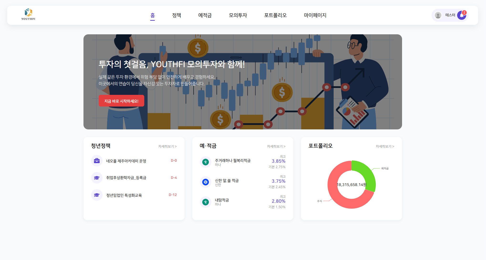
  

  
<em>YouthFi 서비스 홈</em>

  

    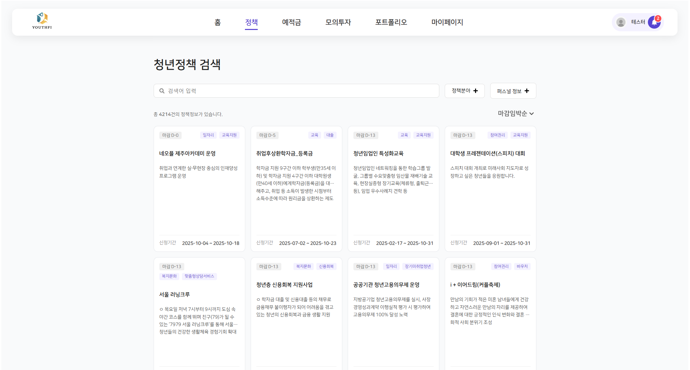
  

  
<em>YouthFi 서비스 정책</em>

  

    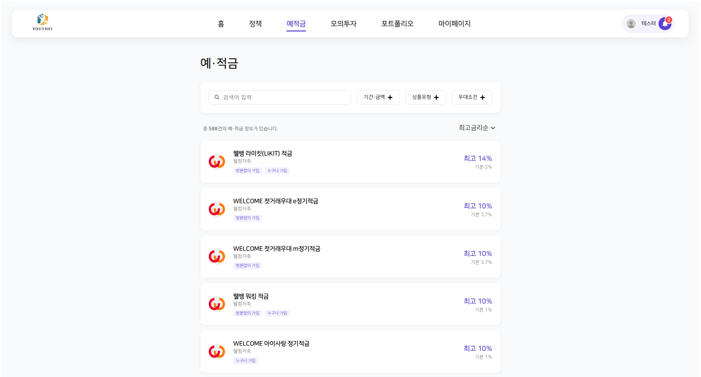
  

  
<em>YouthFi 서비스 예•적금</em>

  

    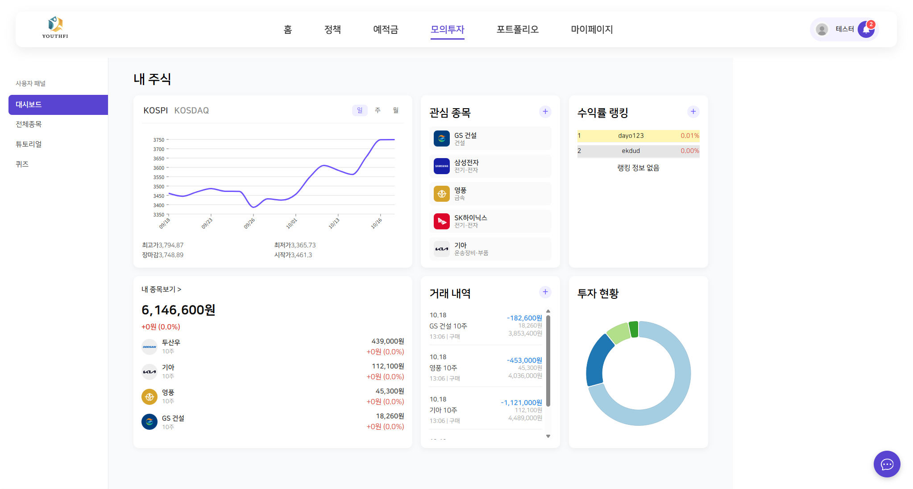
  

  
<em>YouthFi 서비스 모의투자</em>

  

    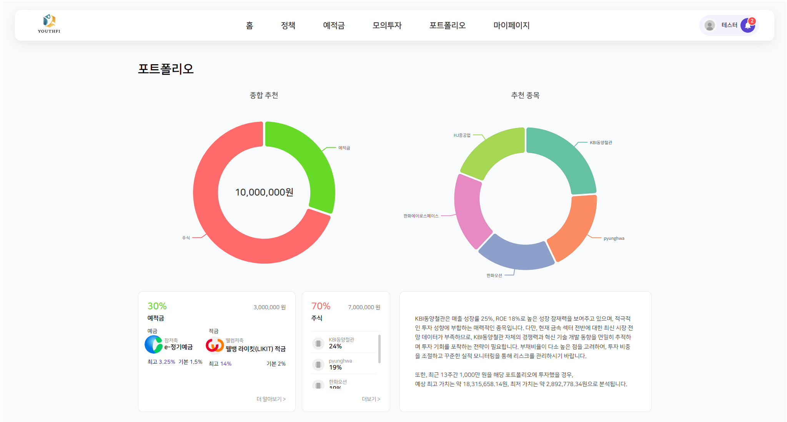
  

  
<em>YouthFi 서비스 AI 포트폴리오</em>

  

    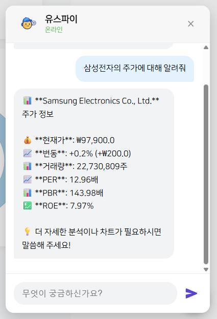
    
  

  
<em>YouthFi 서비스 AI 주가•뉴스 분석</em>

  

    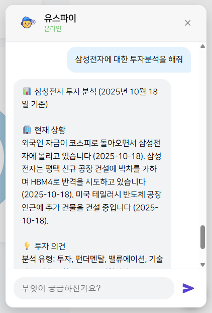
    
    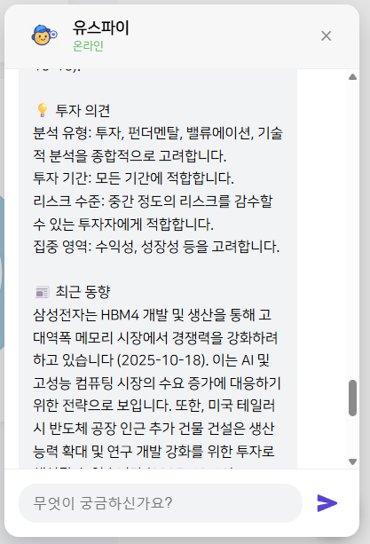
  

  
<em>YouthFi 서비스 AI 투자 분석</em>

  

  <h3>1) 프로젝트 개요</h3>
  

    YouthFi는 만 19~35세 청년의 재무현황과 투자성향을 바탕으로 위험/안전자산 비율을 자동 설계하고,
    거주 지역과 나이 조건에 맞는 청년정책을 한 번에 매칭해주는 맞춤형 자산관리 플랫폼입니다.
    흩어진 금융상품·정책 정보와 개인의 성향·목표를 하나의 사용자 흐름으로 연결해 “지금 내게 맞는 선택”을 제시합니다.
  

  
<strong>입력</strong>: 나이, 거주지역, 소득분위, 투자성향, 투자 가능 금액

  
<strong>출력</strong>: 위험/안전자산 권장 비율, 예상 수익률, 리밸런싱 가이드, 정책 매칭 결과

  <h4>주요 특징</h4>
  <ol>
    <li><strong>개인화 자산배분</strong></li>
    <li><strong>실시간 데이터 연동</strong></li>
    <li><strong>리밸런싱</strong></li>
    <li><strong>청년정책 매칭</strong></li>
    <li><strong>모의투자</strong></li>
    <li><strong>간결 입력–명확 결과</strong></li>
    <li><strong>신뢰·보호 지향 설계</strong></li>
  </ol>

  <h3>2) 기능 구성 (MVP &amp; 필수)</h3>
  <h4>MVP</h4>
  <ul>
    <li>회원관리</li>
    <li>정책/은행상품 소개</li>
    <li>개인화 포트폴리오</li>
    <li>모의투자</li>
    <li>실시간 수익률 랭킹</li>
  </ul>
  <h4>필수 기능 요약</h4>
  <ul>
    <li><strong>회원관리</strong>: 회원가입 · 로그인 · 이메일 인증 · 소셜 로그인 · JWT 관리</li>
    <li><strong>정책·은행상품</strong>: API 수집 및 전처리, 조건 기반 추천과 검색</li>
    <li><strong>개인화 포트폴리오</strong>: 사용자 금융정보 수집 → AI 기반 맞춤 포트폴리오 생성</li>
    <li><strong>모의투자</strong>: 실시간 시세, 매수/매도, 거래 트랜잭션 처리</li>
    <li><strong>실시간 수익률 랭킹 &amp; 알림</strong>: 총수익률 계산, 이벤트 알림</li>
  </ul>

  <h3>3) LLM/AI 기능 (요구사항 하이라이트)</h3>
  <ul>
    <li>
      <strong>데이터 전처리</strong>
      <ul>
        <li>비정형 텍스트에서 이자율·가입조건·한도 등 정보를 추출해 지정 JSON 구조화 (Extraction)</li>
        <li>핵심 내용을 3문장 이내로 요약 (Summarization)</li>
        <li>주거·학자금·목돈 등 카테고리 자동 분류 (Classification)</li>
      </ul>
    </li>
    <li>
      <strong>의미 기반 검색 &amp; RAG</strong>
      <ul>
        <li>질의 벡터화 → Vector Search → RAG 기반 응답 생성</li>
      </ul>
    </li>
    <li>
      <strong>개인화 포트폴리오</strong>
      <ul>
        <li>프롬프트 동적 생성 후 Gemini 호출로 종목/비중 JSON 수신</li>
        <li>추천 근거 문장을 포함하고 응답 JSON을 검증</li>
      </ul>
    </li>
    <li>
      <strong>비기능(성능)</strong>
      <ul>
        <li>LLM API 평균 응답 5초 이내(Timeout 7초) 목표</li>
      </ul>
    </li>
  </ul>

  <h3>4) 실시간 알림 &amp; 랭킹 (CDC/Kafka 파이프라인)</h3>
  <ul>
    <li><strong>Debezium CDC</strong>: Finance Service 배당·거래·보유주식 테이블 변경 사항을 OCI Streaming(Kafka)으로 전송</li>
    <li><strong>Kafka Consumer</strong>: CDC 이벤트 처리 후 개인화 알림 생성 및 수익률 랭킹 TOP10 진입 여부 판단</li>
    <li><strong>수익률 계산</strong>: 요구서 기준 공식 및 예시를 기반으로 포트폴리오 수익률 재계산</li>
    <li><strong>UPDATE 이벤트 처리</strong>: 보유 주식 변동 시 재계산을 트리거해 랭킹과 알림을 즉시 갱신</li>
  </ul>
</section>

<!-- 팀원 구성 -->
<section id="team">
  <h2>👥 팀원 구성</h2>

  

  <table width="840">
    <tbody>
      <tr>
        <td align="center">
          <a href="깃허브주소">
             
            <b>박영두</b>
          </a> 
          PM 코드리뷰 · 인프라 · RAG
        </td>
        <td align="center">
          <a href="깃허브주소">
             
            <b>권도윤</b>
          </a> 
          AI Multi-Agent · RAG
        </td>
        <td align="center">
          <a href="깃허브주소">
             
            <b>김시혁</b>
          </a> 
          백엔드 포트폴리오 · 모의투자
        </td>
        <td align="center">
          <a href="깃허브주소">
             
            <b>김태엽</b>
          </a> 
          백엔드 ETL · 검색 · 정책 및 예적금
        </td>
      </tr>
      <tr>
        <td align="center">
          <a href="깃허브주소">
             
            <b>김다영</b>
          </a> 
          인프라 · 백엔드 알림 · CDC · 인프라
        </td>
        <td align="center">
          <a href="깃허브주소">
             
            <b>정명성</b>
          </a> 
          프론트 파트장 UI/UX
        </td>
        <td align="center">
          <a href="깃허브주소">
             
            <b>곽다현</b>
          </a> 
          프론트 UI/UX
        </td>
        <td align="center">
          <!-- 필요 시 예비 칸 / 삭제 가능 -->
        </td>
      </tr>
    </tbody>
  </table>
  

</section>

<!-- 기술 스택 -->
<section id="tech-stack">
  <h2>🧰 기술 스택</h2>

  <!-- Frontend -->
<h3 align="center">Frontend</h3>
  

  
  
  
  
  
  
  
  
  
  
  

  <!-- Backend -->
<h3 align="center">Backend</h3>
  

    
    
    
    
    
    
  

  <!-- AI / Data -->
<h3 align="center">AI / Data</h3>
  

    
    
    
    
    
    
    
    
    
  

  <!-- Database / Messaging / Caching -->
<h3 align="center">Database / Messaging / Caching</h3>
  

    
    
    
    
  

  <!-- Infra / DevOps -->
<h3 align="center">Infra / DevOps</h3>

  
  
  
  
  
  
  
  
  
  
  
  

  <!-- Monitoring / Docs / Test -->
<h3 align="center">Monitoring / Docs / Test</h3>
  

    
    
    
    
    
  

</section>

<!-- 주요 API -->
<section id="api">
  <h2>🔑 주요 API (요약)</h2>

  
Auth-Service에서 JWT를 발급·검증하고, NGINX Ingress가 Edge 인증을 수행한 뒤 각 백엔드 서비스가 동작합니다. 아래는 서비스별 대표 엔드포인트와 인증 경로 요약입니다.

  <h3>Auth · 사용자 관리 (Auth-Service)</h3>
  <table>
    <thead>
      <tr>
        <th align="left">Method</th>
        <th align="left">Endpoint</th>
        <th align="left">주요 기능</th>
        <th align="center">인증</th>
      </tr>
    </thead>
    <tbody>
      <tr><td>POST</td><td><code>/api/auth/signup</code></td><td>이메일 인증 완료 후 회원가입</td><td align="center">Public</td></tr>
      <tr><td>POST</td><td><code>/api/auth/login</code></td><td>JWT 발급 (access / refresh)</td><td align="center">Public</td></tr>
      <tr><td>DELETE</td><td><code>/api/auth/logout</code></td><td>토큰 무효화 로그아웃</td><td align="center">JWT</td></tr>
      <tr><td>DELETE</td><td><code>/api/auth/logout/user</code></td><td><code>@CurrentUser</code> 기반 로그아웃</td><td align="center"> JWT</td></tr>
      <tr><td>POST</td><td><code>/api/auth/reissue</code></td><td>Refresh Token으로 Access Token 재발급</td><td align="center"> JWT</td></tr>
      <tr><td>GET</td><td><code>/api/auth/profile</code></td><td>토큰 유효성 검증 및 프로필 조회</td><td align="center">JWT</td></tr>
      <tr><td>PATCH</td><td><code>/api/auth/profile</code></td><td>회원 정보 수정 / 비밀번호 변경</td><td align="center">JWT</td></tr>
      <tr><td>POST</td><td><code>/api/auth/login/{provider}</code></td><td>OAuth2 소셜 로그인 · 회원가입</td><td align="center">Public</td></tr>
      <tr><td>POST</td><td><code>/api/email/verification/send</code></td><td>6자리 이메일 인증 코드 발송</td><td align="center">Public</td></tr>
      <tr><td>POST</td><td><code>/api/email/verification/verify</code></td><td>인증 코드 검증 및 이메일 인증 완료</td><td align="center">Public</td></tr>
    </tbody>
  </table>

  <h3>청년 정책 (Policy-Service)</h3>
  <table>
    <thead>
      <tr>
        <th align="left">Method</th>
        <th align="left">Endpoint</th>
        <th align="left">주요 기능</th>
        <th align="center">인증</th>
      </tr>
    </thead>
    <tbody>
      <tr><td>GET</td><td><code>/api/master/region</code></td><td>지역 필터 목록</td><td align="center">Public</td></tr>
      <tr><td>GET</td><td><code>/api/master/category</code></td><td>카테고리 필터 목록</td><td align="center">Public</td></tr>
      <tr><td>GET</td><td><code>/api/master/education</code></td><td>학력 필터 목록</td><td align="center">Public</td></tr>
      <tr><td>GET</td><td><code>/api/master/job-status</code></td><td>취업 상태 필터 목록</td><td align="center">Public</td></tr>
      <tr><td>GET</td><td><code>/api/master/major</code></td><td>전공 요건 필터</td><td align="center">Public</td></tr>
      <tr><td>GET</td><td><code>/api/master/specialization</code></td><td>특화 분야 필터</td><td align="center">Public</td></tr>
      <tr><td>GET</td><td><code>/api/master/keyword</code></td><td>정책 키워드 목록</td><td align="center">Public</td></tr>
      <tr><td>GET</td><td><code>/api/policies</code></td><td>정책 리스트 (조건 검색 · 페이징)</td><td align="center">Public</td></tr>
      <tr><td>GET</td><td><code>/api/policies/{id}</code></td><td>정책 상세 · 신청 정보</td><td align="center">Public</td></tr>
    </tbody>
  </table>

  <h3>금융 상품 (예 · 적금, Finance-Service)</h3>
  <table>
    <thead>
      <tr>
        <th align="left">Method</th>
        <th align="left">Endpoint</th>
        <th align="left">주요 기능</th>
        <th align="center">인증</th>
      </tr>
    </thead>
    <tbody>
      <tr><td>GET</td><td><code>/api/fin/master/banks</code></td><td>은행 목록 검색 / 권역 필터</td><td align="center">Public</td></tr>
      <tr><td>GET</td><td><code>/api/fin/master/presets</code></td><td>기간 · 상품 유형 등 선택값 프리셋</td><td align="center">Public</td></tr>
      <tr><td>GET</td><td><code>/api/fin/products</code></td><td>예 · 적금 상품 검색 · 필터 · 정렬</td><td align="center">Public</td></tr>
      <tr><td>GET</td><td><code>/api/fin/products/{id}</code></td><td>상품 상세 및 가입 조건</td><td align="center">Public</td></tr>
      <tr><td>GET</td><td><code>/api/fin/products/{id}/rates</code></td><td>기간별 금리 옵션 조회</td><td align="center">Public</td></tr>
      <tr><td>GET</td><td><code>/api/fin/products/{id}/calculate</code></td><td>예상 실효금리 · 만기금액 계산</td><td align="center">Public</td></tr>
    </tbody>
  </table>

  <h3>투자 정보 · 모의투자 (Finance-Service)</h3>
  <table>
    <thead>
      <tr>
        <th align="left">Method</th>
        <th align="left">Endpoint</th>
        <th align="left">주요 기능</th>
        <th align="center">인증</th>
      </tr>
    </thead>
    <tbody>
      <tr><td>POST</td><td><code>/api/auth/investment-info</code></td><td>투자 성향 및 기본 정보 등록</td><td align="center">Edge JWT</td></tr>
      <tr><td>GET</td><td><code>/api/auth/investment-info</code></td><td>저장된 투자 정보 조회</td><td align="center">Edge JWT</td></tr>
      <tr><td>PUT</td><td><code>/api/auth/investment-info</code></td><td>투자 정보 수정</td><td align="center">Edge JWT</td></tr>
      <tr><td>POST</td><td><code>/api/portfolios/recommendations</code></td><td>Gemini 기반 맞춤 포트폴리오 요청</td><td align="center">Edge JWT</td></tr>
      <tr><td>GET</td><td><code>/api/portfolios/expected-return</code></td><td>포트폴리오별 예상 수익률 계산</td><td align="center">Edge JWT</td></tr>
      <tr><td>GET</td><td><code>/api/finance/stock/showall</code></td><td>전체 주식 실시간 시세 조회</td><td align="center">Edge JWT</td></tr>
      <tr><td>POST</td><td><code>/api/finance/stock/buy</code></td><td>모의 매수 주문 생성</td><td align="center">Edge JWT</td></tr>
      <tr><td>POST</td><td><code>/api/finance/stock/sell</code></td><td>모의 매도 주문 생성</td><td align="center">Edge JWT</td></tr>
      <tr><td>GET</td><td><code>/api/finance/stock/value</code></td><td>시드머니 · 잔고 · 총평가금액 조회</td><td align="center">Edge JWT</td></tr>
      <tr><td>GET</td><td><code>/api/finance/stock/my</code></td><td>보유 종목 및 평가 조회</td><td align="center">Edge JWT</td></tr>
      <tr><td>GET</td><td><code>/api/finance/stock/execution</code></td><td>사용자 전체 거래 내역</td><td align="center">Edge JWT</td></tr>
      <tr><td>PATCH</td><td><code>/api/finance/stock/interest/add/{stockId}</code></td><td>관심 종목 등록</td><td align="center">Edge JWT</td></tr>
      <tr><td>PATCH</td><td><code>/api/finance/stock/interest/cancel/{stockId}</code></td><td>관심 종목 해제</td><td align="center">Edge JWT</td></tr>
      <tr><td>GET</td><td><code>/api/finance/stock/interest/show</code></td><td>관심 종목 목록 조회</td><td align="center">Edge JWT</td></tr>
    </tbody>
  </table>

  <h3>실시간 알림 · 랭킹 (Notify-Service)</h3>
  <table>
    <thead>
      <tr>
        <th align="left">Method</th>
        <th align="left">Endpoint</th>
        <th align="left">주요 기능</th>
        <th align="center">인증</th>
      </tr>
    </thead>
    <tbody>
      <tr><td>GET</td><td><code>/api/notifications</code></td><td>사용자 알림 목록 (페이징)</td><td align="center">Edge JWT</td></tr>
      <tr><td>PATCH</td><td><code>/api/notifications/{notificationId}/read</code></td><td>단일 알림 읽음 처리</td><td align="center">Edge JWT</td></tr>
      <tr><td>PATCH</td><td><code>/api/notifications/read-all</code></td><td>전체 알림 읽음 처리</td><td align="center">Edge JWT</td></tr>
      <tr><td>POST</td><td><code>/api/internal/notifications/trade</code></td><td>거래 체결 알림 생성</td><td align="center">Internal</td></tr>
      <tr><td>POST</td><td><code>/api/internal/notifications/ranking-entered</code></td><td>수익률 랭킹 진입 알림 생성</td><td align="center">Internal</td></tr>
      <tr><td>POST</td><td><code>/api/internal/notifications/dividend</code></td><td>배당금 지급 알림 생성</td><td align="center">Internal</td></tr>
    </tbody>
  </table>

  <h3>LLM · AI 서비스 (Cloud Run · Gemini)</h3>
  <table>
    <thead>
      <tr>
        <th align="left">Method</th>
        <th align="left">Endpoint</th>
        <th align="left">주요 기능</th>
        <th align="center">인증</th>
      </tr>
    </thead>
    <tbody>
      <tr><td>POST</td><td><code>/api/v1/chat</code></td><td>자연어 질의 기반 정책 · 금융상품 의미 검색, 투자 분석 · 현재 주가 · 실시간 기사 검색</td><td align="center">Edge JWT → GCP SA</td></tr>
      <tr><td>POST</td><td><code>/api/v1/protfolio/enhanced</code></td><td>투자 성향 기반 주식 포트폴리오 및 근거 반환</td><td align="center">Edge JWT → GCP SA</td></tr>
    </tbody>
  </table>

  
<em>표기</em>: <code>Edge JWT</code>는 NGINX Ingress의 JWT 검증 이후 백엔드 호출, <code>Internal</code>은 서비스 간 호출(예: CDC Consumer), <code>Edge JWT → GCP SA</code>는 Finance-Service가 Cloud Run Gemini 엔드포인트 호출 시 <code>GCP_SA_KEY</code>로 서비스 계정 인증을 수행함을 의미합니다.

  
<a href="#top">맨 위로 ⤴</a>

</section>

<!-- 저장소 · 브랜치 전략 · 프로젝트 아키텍처 -->
<section id="repository">
  <h2>📦 저장소 &nbsp;·&nbsp; 브랜치 전략 · 프로젝트 구조</h2>

<h3>브랜치 전략 (Git-flow 기반)</h3>
  <ul>
    <li><code>main</code> — 배포용 안정 브랜치. 태깅(<code>vX.Y.Z</code>) 후 배포.</li>
    <li><code>develop</code> — 통합 개발 브랜치. 기능/버그 픽스 머지 대상.</li>
    <li><code>feature/&lt;scope&gt;-&lt;short-desc&gt;</code> — 기능 단위 작업. 완료 시 PR → <code>develop</code>.</li>
    <li><code>hotfix/&lt;issue&gt;</code> — 긴급 수정. PR → <code>main</code> 및 <code>develop</code> 양쪽 반영.</li>
    <li><code>release/&lt;version&gt;</code> — 릴리즈 준비(버전, 문서, 마이그레이션) 후 <code>main</code> 병합.</li>
  </ul>

<h4>PR 규칙</h4>
  <ul>
    <li>PR 템플릿 사용: 배경/변경점/테스트/스크린샷/체크리스트 포함</li>
    <li>리뷰 1명 이상 승인(🚦 최소 1 Approve), CI 통과 필수</li>
    <li>라벨: <code>feature</code>, <code>fix</code>, <code>refactor</code> 등</li>
  </ul>

<h4>커밋 컨벤션 (Conventional Commits)</h4>
  <pre><code>feat(auth): add refresh token rotation
fix(api): handle null imageUrl in profile response
refactor(ui): split ReportChart into small components
docs(readme): add tech stack badges
chore(ci): bump node to 20.x in workflow
</code></pre>

<h3>Infra 아키텍처</h3>

  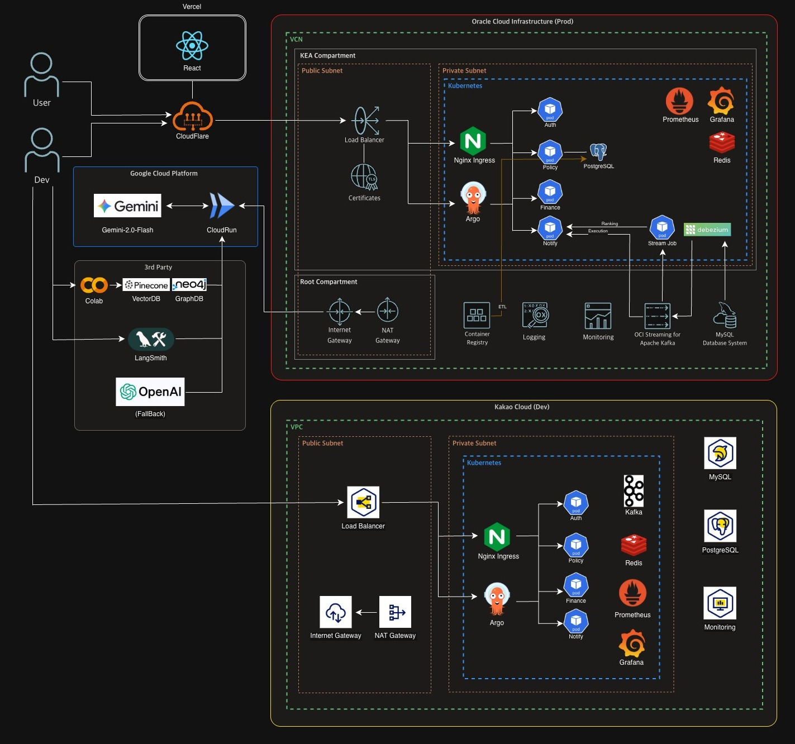

<h3>CDC 아키텍처</h3>

  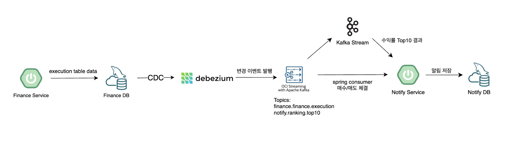

<h3>DevOps 아키텍처</h3>

  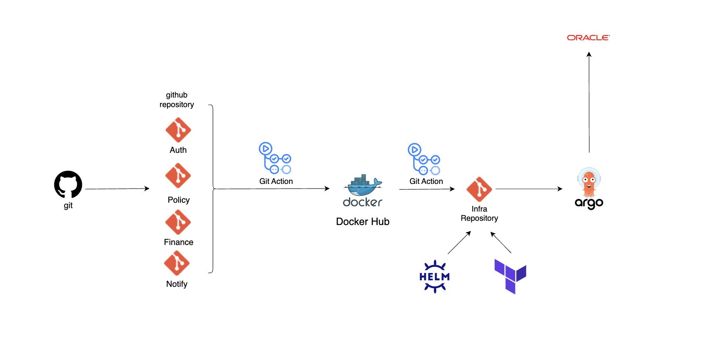

</section>

<!-- 도메인 예시: portfolio (요약) -->
<section id="domain-example-portfolio">
  <h3>🧩 도메인 예시: <code>portfolio</code></h3>
  

    아래는 <code>portfolio</code> 도메인의 대표 구성요소를 간단히 요약한 예시입니다.
    전체 코드는 레포지토리에서 확인하세요.
  

  <!-- 1) DTO · Request -->
  

    
<strong>1) DTO · Request</strong>

    // CompleteInvestmentProfileRequest.java
    public record CompleteInvestmentProfileRequest(
        @Schema(description = "투자성향 유형", example = "CONSERVATIVE")
        InvestmentProfile.InvestmentProfileType investmentProfile,
        
        @Schema(description = "투자가능 자산", example = "10000000.00")
        BigDecimal availableAssets,
        
        @Schema(description = "투자 목표", example = "EDUCATION")
        InvestmentProfile.InvestmentGoal investmentGoal,
        
        @Schema(description = "감당가능 손실", example = "TEN_PERCENT")
        InvestmentProfile.LossTolerance lossTolerance,
        
        @Schema(description = "금융 이해도", example = "MEDIUM")
        InvestmentProfile.FinancialKnowledge financialKnowledge,
        
        @Schema(description = "기대 이익", example = "TWO_HUNDRED_PERCENT")
        InvestmentProfile.ExpectedProfit expectedProfit,
        
        @Schema(description = "관심섹터명 목록", example = "[\"전기·전자\", \"건설\", \"IT 서비스\"]")
        List<String> interestedSectorNames
    ) {}
    
    // ChatRequest.java
    public record ChatRequest(
        String message,
        String user_id,
        String session_id
    ) {}
  

  <!-- 2) DTO · Response -->
  

    
<strong>2) DTO · Response</strong>

    // PortfolioResponse.java
    public record PortfolioResponse(
        Long portfolioId,
        String userId,
        List<RecommendedStock> recommendedStocks,
        BigDecimal allocationSavings,
        BigDecimal highestValue,
        BigDecimal lowestValue,
        LocalDateTime createdAt,
        LocalDateTime updatedAt
    ) {
        public record RecommendedStock(
            String stockId,
            String stockName,
            BigDecimal allocationPct,
            String sectorName,
            String reason
        ) {}
    }
    
    // PortfolioRiskAnalysisResponse.java
    public record PortfolioRiskAnalysisResponse(
        BigDecimal originalInvestment,
        BigDecimal highestValue,
        BigDecimal lowestValue,
        BigDecimal currentValue,
        BigDecimal highestReturn,
        BigDecimal lowestReturn,
        BigDecimal currentReturn,
        String riskLevel
    ) {
        public static PortfolioRiskAnalysisResponse getDefault(BigDecimal investment) {
            return new PortfolioRiskAnalysisResponse(
                investment, investment, investment, investment,
                BigDecimal.ZERO, BigDecimal.ZERO, BigDecimal.ZERO, "MEDIUM"
            );
        }
    }
    
    // ChatResponse.java
    public record ChatResponse(
        String replyText,
        boolean success,
        String errorMessage
    ) {}
  

  <!-- 3) Entity -->
  

    
<strong>3) Entity</strong>

    // InvestmentProfile.java
    @Entity
    @Table(name = "investment_profiles")
    @Getter
    @NoArgsConstructor(access = AccessLevel.PROTECTED)
    public class InvestmentProfile extends BaseEntity {
        @Id
        @GeneratedValue(strategy = GenerationType.IDENTITY)
        private Long profileId;
        
        @OneToOne(fetch = FetchType.LAZY)
        @JoinColumn(name = "userId", nullable = false)
        private User user;
        
        @Enumerated(EnumType.STRING)
        @Column(nullable = false)
        private InvestmentProfileType investmentProfile;
        
        @Column(nullable = false, precision = 15, scale = 2)
        private BigDecimal availableAssets;
        
        @Enumerated(EnumType.STRING)
        @Column(nullable = false)
        private InvestmentGoal investmentGoal;
        
        @Enumerated(EnumType.STRING)
        @Column(nullable = false)
        private LossTolerance lossTolerance;
        
        @Enumerated(EnumType.STRING)
        @Column(nullable = false)
        private FinancialKnowledge financialKnowledge;
        
        @Enumerated(EnumType.STRING)
        @Column(nullable = false)
        private ExpectedProfit expectedProfit;
        
        @OneToMany(mappedBy = "investmentProfile", cascade = CascadeType.ALL, orphanRemoval = true)
        private List<InvestmentProfileSector> investmentProfileSectors = new ArrayList<>();
        
        public enum InvestmentProfileType {
            CONSERVATIVE("안정형"),
            CONSERVATIVE_SEEKING("안정추구형"),
            RISK_NEUTRAL("위험중립형"),
            AGGRESSIVE("적극투자형"),
            VERY_AGGRESSIVE("공격투자형");
        }
        
        public enum InvestmentGoal {
            EDUCATION("학비"),
            LIVING_EXPENSES("생활비"),
            HOUSE_PURCHASE("주택마련"),
            ASSET_GROWTH("자산증식"),
            DEBT_REPAYMENT("채무상환");
        }
        
        public enum LossTolerance {
            NO_LOSS("원금 손실 없음"),
            TEN_PERCENT("원금의 10%"),
            THIRTY_PERCENT("원금의 30%"),
            FIFTY_PERCENT("원금의 50%"),
            SEVENTY_PERCENT("원금의 70%"),
            FULL_AMOUNT("원금 전액");
        }
    }
    
    // Portfolio.java
    @Entity
    @Table(name = "portfolios")
    @Getter
    @NoArgsConstructor(access = AccessLevel.PROTECTED)
    public class Portfolio extends BaseEntity {
        @Id
        @GeneratedValue(strategy = GenerationType.IDENTITY)
        private Long portfolioId;
        
        @ManyToOne(fetch = FetchType.LAZY)
        @JoinColumn(name = "userId", nullable = false)
        private User user;
        
        @Column(nullable = false, length = 100)
        private String portfolioName;
        
        @Column(precision = 18, scale = 2)
        private BigDecimal highestValue;
        
        @Column(precision = 18, scale = 2)
        private BigDecimal lowestValue;
        
        @OneToMany(mappedBy = "portfolio", cascade = CascadeType.ALL, orphanRemoval = true)
        private List<PortfolioStock> portfolioStocks = new ArrayList<>();
        
        public void updatePortfolio(String portfolioName, BigDecimal highestValue, BigDecimal lowestValue) {
            this.portfolioName = portfolioName;
            this.highestValue = highestValue;
            this.lowestValue = lowestValue;
        }
    }
  

  <!-- 4) Repository -->
  

    
<strong>4) Repository</strong>

    // InvestmentProfileRepository.java
    public interface InvestmentProfileRepository extends JpaRepository<InvestmentProfile, Long> {
        Optional<InvestmentProfile> findByUserUserId(String userId);
        boolean existsByUserUserId(String userId);
    }
    
    // PortfolioRepository.java
    public interface PortfolioRepository extends JpaRepository<Portfolio, Long> {
        List<Portfolio> findByUserUserIdOrderByCreatedAtDesc(String userId);
    }
    
    // PortfolioStockRepository.java
    public interface PortfolioStockRepository extends JpaRepository<PortfolioStock, Long> {
        List<PortfolioStock> findByPortfolioPortfolioId(Long portfolioId);
    }
  

  <!-- 5) Service (요약) -->
  

    
<strong>5) Service (요약)</strong>

    // InvestmentProfileService.java (발췌)
    @Service
    @RequiredArgsConstructor
    public class InvestmentProfileService {
        private final InvestmentProfileRepository investmentProfileRepository;
        private final UserRepository userRepository;
        
        public InvestmentProfile createInvestmentProfile(String userId, 
                                                       InvestmentProfileType investmentProfile,
                                                       BigDecimal availableAssets,
                                                       InvestmentGoal investmentGoal,
                                                       LossTolerance lossTolerance,
                                                       FinancialKnowledge financialKnowledge,
                                                       ExpectedProfit expectedProfit,
                                                       List<String> interestedSectorNames) {
            User user = userRepository.findById(userId)
                    .orElseThrow(() -> PortfolioException.userNotFound(userId));
            
            InvestmentProfile profile = InvestmentProfile.builder()
                    .user(user)
                    .investmentProfile(investmentProfile)
                    .availableAssets(availableAssets)
                    .investmentGoal(investmentGoal)
                    .lossTolerance(lossTolerance)
                    .financialKnowledge(financialKnowledge)
                    .expectedProfit(expectedProfit)
                    .build();
            
            return investmentProfileRepository.save(profile);
        }
        
        public Optional<InvestmentProfile> getInvestmentProfileByUserId(String userId) {
            return investmentProfileRepository.findByUserUserId(userId);
        }
    }
    
    // PortfolioService.java (발췌)
    @Service
    @RequiredArgsConstructor
    public class PortfolioService {
        private final PortfolioRepository portfolioRepository;
        private final UserRepository userRepository;
        
        public Portfolio createPortfolio(String userId, String portfolioName,
                                       BigDecimal highestValue, BigDecimal lowestValue) {
            User user = userRepository.findById(userId)
                    .orElseThrow(() -> PortfolioException.userNotFound(userId));
            
            Portfolio portfolio = Portfolio.builder()
                    .user(user)
                    .portfolioName(portfolioName)
                    .highestValue(highestValue)
                    .lowestValue(lowestValue)
                    .build();
            return portfolioRepository.save(portfolio);
        }
        
        public List<Portfolio> findPortfoliosByUserId(String userId) {
            return portfolioRepository.findByUserUserIdOrderByCreatedAtDesc(userId);
        }
    }
    
    // PortfolioRiskService.java (발췌)
    @Service
    @RequiredArgsConstructor
    public class PortfolioRiskService {
        private final StockCurrentPriceApiClient stockCurrentPriceApiClient;
        
        public PortfolioRiskAnalysisResponse calculatePortfolioRisk(
                List<CompleteInvestmentProfileResponse.RecommendedStock> recommendedStocks, 
                BigDecimal investmentAmount) {
            BigDecimal totalHighValue = BigDecimal.ZERO;
            BigDecimal totalLowValue = BigDecimal.ZERO;
            BigDecimal currentValue = BigDecimal.ZERO;
            
            for (CompleteInvestmentProfileResponse.RecommendedStock stock : recommendedStocks) {
                StockPriceInfoResponse priceInfo = getStockPriceInfo(stock.stockId());
                
                BigDecimal stockInvestment = investmentAmount
                        .multiply(stock.allocationPct())
                        .divide(BigDecimal.valueOf(100), 2, RoundingMode.HALF_UP);
                
                BigDecimal highValue = stockInvestment
                        .multiply(priceInfo.w52HighPrice())
                        .divide(priceInfo.currentPrice(), 2, RoundingMode.HALF_UP);
                
                BigDecimal lowValue = stockInvestment
                        .multiply(priceInfo.w52LowPrice())
                        .divide(priceInfo.currentPrice(), 2, RoundingMode.HALF_UP);
                
                totalHighValue = totalHighValue.add(highValue);
                totalLowValue = totalLowValue.add(lowValue);
                currentValue = currentValue.add(stockInvestment);
            }
            
            BigDecimal highReturn = calculateReturnRate(investmentAmount, totalHighValue);
            BigDecimal lowReturn = calculateReturnRate(investmentAmount, totalLowValue);
            
            return new PortfolioRiskAnalysisResponse(
                    investmentAmount, totalHighValue, totalLowValue, currentValue,
                    highReturn, lowReturn, BigDecimal.ZERO,
                    calculateRiskLevel(highReturn, lowReturn)
            );
        }
        
        private String calculateRiskLevel(BigDecimal highReturn, BigDecimal lowReturn) {
            BigDecimal riskRange = highReturn.subtract(lowReturn);
            if(riskRange.compareTo(BigDecimal.valueOf(50)) > 0) return "HIGH";
            else if (riskRange.compareTo(BigDecimal.valueOf(20)) > 0) return "MEDIUM";
            else return "LOW";
        }
    }
  

  <!-- 6) UseCase -->
  

    
<strong>6) UseCase</strong>

    // PortfolioUseCase.java (발췌)
    @Service
    @Transactional(readOnly = true)
    @RequiredArgsConstructor
    public class PortfolioUseCase {
        private final InvestmentProfileService investmentProfileService;
        private final PortfolioService portfolioService;
        private final PortfolioStockService portfolioStockService;
        private final LLMApiClient llmApiClient;
        private final PortfolioRiskService portfolioRiskCalculator;
        
        @Transactional
        public PortfolioResponse generateAiPortfolioRecommendation(String userId) {
            // 1. 투자 프로필 조회
            InvestmentProfile investmentProfile = investmentProfileService.getInvestmentProfileByUserId(userId)
                    .orElseThrow(() -> PortfolioException.investmentProfileNotFound());
            
            // 2. LLM API 호출하여 포트폴리오 추천 받음
            InvestmentProfileResponse profileResponse = investmentProfileService.toInvestmentProfileResponse(investmentProfile);
            Map<String, Object> aiResponse = llmApiClient.requestPortfolioRecommendation(profileResponse);
            CompleteInvestmentProfileResponse llmResponse = convertAiResponseToCompleteInvestmentProfileResponse(aiResponse);
            
            // 3. 위험도 분석 수행
            List<CompleteInvestmentProfileResponse.RecommendedStock> safeStocks =
                    Optional.ofNullable(llmResponse.recommendedStocks()).orElse(Collections.emptyList());
            
            PortfolioRiskAnalysisResponse riskAnalysis = portfolioRiskCalculator.calculatePortfolioRisk(
                    safeStocks, investmentProfile.getAvailableAssets()
            );
            
            // 4. 포트폴리오 엔티티 생성 및 저장
            Portfolio portfolio = portfolioService.createPortfolio(
                    userId, "AI 추천 포트폴리오",
                    riskAnalysis.highestValue(), riskAnalysis.lowestValue()
            );
            
            // 5. 포트폴리오에 주식 추가
            for (CompleteInvestmentProfileResponse.RecommendedStock stock : safeStocks) {
                portfolioStockService.addStockToPortfolio(portfolio.getPortfolioId(), 
                        stock.stockId(), stock.allocationPct());
            }
            
            // 6. PortfolioResponse 반환
            return new PortfolioResponse(
                    portfolio.getPortfolioId(), userId,
                    convertToPortfolioRecommendedStocks(safeStocks),
                    llmResponse.allocationSavings(),
                    riskAnalysis.highestValue(), riskAnalysis.lowestValue(),
                    portfolio.getCreatedAt(), portfolio.getUpdatedAt()
            );
        }
    }
    
    // InvestmentProfileUseCase.java (발췌)
    @Service
    @Transactional(readOnly = true)
    @RequiredArgsConstructor
    public class InvestmentProfileUseCase {
        private final InvestmentProfileService investmentProfileService;
        private final UserRepository userRepository;
        
        @Transactional
        public InvestmentProfileResponse completeInvestmentProfile(String userId, CompleteInvestmentProfileRequest request) {
            Optional<InvestmentProfile> existingProfile = investmentProfileService.getInvestmentProfileByUserId(userId);
            InvestmentProfile profile;
            
            if (existingProfile.isPresent()) {
                profile = investmentProfileService.updateInvestmentProfile(
                    existingProfile.get().getProfileId(), 
                    request.investmentProfile(), request.availableAssets(),
                    request.investmentGoal(), request.lossTolerance(),
                    request.financialKnowledge(), request.expectedProfit(),
                    request.interestedSectorNames()
                );
            } else {
                profile = investmentProfileService.createInvestmentProfile(
                    userId, request.investmentProfile(), request.availableAssets(),
                    request.investmentGoal(), request.lossTolerance(),
                    request.financialKnowledge(), request.expectedProfit(),
                    request.interestedSectorNames()
                );
            }
            return investmentProfileService.toInvestmentProfileResponse(profile);
        }
    }
    
    // ChatUseCase.java (발췌)
    @Service
    @RequiredArgsConstructor
    public class ChatUseCase {
        private final ChatSessionService chatSessionService;
        
        @Transactional
        public ChatResponse processChat(ChatRequest request, String userId) {
            ChatRequest chatRequest = new ChatRequest(
                    request.message(), userId, request.session_id()
            );
            return chatSessionService.processChat(chatRequest);
        }
    }
  

  <!-- 7) Controller -->
  

    
<strong>7) Controller</strong>

    // InvestmentProfileController.java (발췌)
    @RestController
    @RequestMapping("/api/user/investment-profile")
    @RequiredArgsConstructor
    @Tag(name = "InvestmentProfile", description = "투자성향 프로필 관리 API")
    public class InvestmentProfileController implements BaseApi {
        
        private final InvestmentProfileUseCase investmentProfileUseCase;
        private final PortfolioUseCase portfolioRecommendationUseCase;
        
        @PostMapping("/complete")
        @Operation(summary = "투자성향 설문 완료", description = "투자성향 설문을 완료, 새 프로필을 생성 및 저장합니다.")
        public BaseResponse<InvestmentProfileResponse> completeInvestmentProfile(
                @RequestBody CompleteInvestmentProfileRequest request) {
            String userId = SecurityUtils.getCurrentUserId();
            InvestmentProfileResponse profile = investmentProfileUseCase.completeInvestmentProfile(userId, request);
            return BaseResponse.onSuccess(profile);
        }
        
        @PostMapping("/send-to-llm")
        @Operation(summary = "LLM 포트폴리오 추천 요청", description = "투자성향 프로필을 기반으로 포트폴리오를 생성하고 저장합니다.")
        public BaseResponse<PortfolioResponse> sendProfileToLLM() {
            String userId = SecurityUtils.getCurrentUserId();
            PortfolioResponse response = portfolioRecommendationUseCase.generateAiPortfolioRecommendation(userId);
            return BaseResponse.onSuccess(response);
        }
        
        @GetMapping("/exists")
        @Operation(summary = "투자성향 완료 여부 확인", description = "사용자가 투자성향 설문을 완료했는지 확인합니다.")
        public BaseResponse<Boolean> hasCompletedInvestmentProfile() {
            String userId = SecurityUtils.getCurrentUserId();
            boolean exists = investmentProfileUseCase.hasCompletedInvestmentProfile(userId);
            return BaseResponse.onSuccess(exists);
        }
    }
    
    // AiChatController.java (발췌)
    @RestController
    @RequestMapping("/api/ai/chat")
    @RequiredArgsConstructor
    @Tag(name = "AI 챗봇", description = "AI 챗봇과의 대화 관련 API")
    @SecurityRequirement(name = "X-User-Id")
    public class AiChatController implements BaseApi {
        
        private final ChatUseCase chatUseCase;
        
        @PostMapping
        @Operation(summary = "AI 챗봇 채팅", description = "AI 챗봇과 대화를 진행합니다.")
        public BaseResponse<ChatResponse> chat(@Valid @RequestBody ChatRequest request) {
            String userId = SecurityUtils.getCurrentUserId();
            ChatResponse response = chatUseCase.processChat(request, userId);
            return BaseResponse.onSuccess(response);
        }
    }
  

  
<a href="#repository">↑ 프로젝트 구조로 돌아가기</a>

</section>

<!-- 개발 기간 · 작업 관리 -->
<section id="schedule">
  <h2>🗓️ 개발 기간 · 작업 관리</h2>
  <table>
    <thead><tr><th>기간</th><th>스프린트 목표</th><th>주요 산출물</th></tr></thead>
    <tbody>
      <tr>
        <td>2025-09-01 ~ 2025-09-14 (1~2주차)</td>
        <td>요구사항·UI/UX 설계·DB/Swagger 초안</td>
        <td>요구분석서, ERD, OpenAPI v3, 컴포넌트 맵</td>
      </tr>
      <tr>
        <td>2025-09-15 ~ 2025-10-05 (3~5주차)</td>
        <td>핵심 기능 개발(정책/예적금/성향/포트폴리오/모의투자) · 프롬프트 엔지니어링</td>
        <td>FE 페이지/상태, BE 도메인·ETL, RAG 프롬프트</td>
      </tr>
      <tr>
        <td>2025-10-06 ~ 2025-10-16 (6~7주차)</td>
        <td>기능구현 및 로컬 테스트</td>
        <td>BE 도메인, RAG 로컬 테스트, 프론트 API 연결</td>
      </tr>
      <tr>
        <td>2025-10-17 ~ 2025-10-24 (8주차 · 진행중)</td>
        <td>통합·안정화 테스트, 배포·운영</td>
        <td>E2E/통합 테스트, 성능·보안 점검, 버그픽스, 릴리즈 노트, 대시보드, 알림 룰, 운영 가이드</td>
      </tr>
    </tbody>
  </table>
<h3>작업 관리 방식</h3>
  <ul>
    <li><strong>이슈 추적</strong>: GitHub Issues (템플릿: <em>bug/feature/chore</em>)</li>
    <li><strong>JIRA</strong>: GitHub Projects — <em>Backlog → In&nbsp;Progress → In&nbsp;Review → Done</em></li>
    <li><strong>Main Merge 제한</strong>: 브렌치 제약을 통한 리뷰어 필수</li>
    <li><strong>품질 게이트</strong>: CI 빌드/테스트/리포트, 린트·포맷·타입체크</li>
  </ul>
</section>

<!-- 핵심 기능 구현 내용 -->
<section id="quality-notes">
  <h2>🧠 핵심 기능 구현 내용</h2>

  <!-- 1) AI 기반 개인화 포트폴리오 추천 -->
<h3>1) AI 기반 개인화 포트폴리오 추천</h3>
  

    사용자의 투자성향 설문을 기반으로 LangGraph 메타 에이전트 시스템이 맞춤형 포트폴리오를 생성하고, 
    Pinecone RAG와 Neo4j 지식그래프를 활용한 실시간 위험도 분석을 통해 안전한 투자 조합을 제공합니다.
  

<h4>① 투자성향 설문 시스템</h4>
  <ul>
    <li><strong>5가지 투자성향</strong>: 안정형, 안정추구형, 위험중립형, 적극투자형, 공격투자형</li>
    <li><strong>종합 프로필 수집</strong>: 투자목표, 손실감수능력, 금융이해도, 기대수익률, 관심섹터</li>
    <li><strong>동적 설문 완료</strong>: 기존 프로필 존재 시 업데이트, 신규 사용자 시 생성</li>
    <li><strong>LLM 기반 프로필 분석</strong>: QueryAnalyzerAgent가 사용자 응답을 분석하여 투자 성향 정확도 평가</li>
    <li><strong>프로필 검증</strong>: ConfidenceCalculatorAgent가 A~F 등급으로 프로필 신뢰도 평가</li>
  </ul>

<h4>② AI 포트폴리오 생성</h4>
  <ul>
    <li><strong>LangGraph 워크플로우</strong>: ServicePlannerAgent가 포트폴리오 생성 전략 수립</li>
    <li><strong>다중 에이전트 협업</strong>: AnalysisAgent(투자분석) + DataAgent(실시간데이터) + NewsAgent(시장동향) 병렬 실행</li>
    <li><strong>RAG 기반 분석</strong>: Pinecone에서 4,961개 금융 문서 검색하여 재무제표 분석</li>
    <li><strong>Neo4j 지식그래프</strong>: 30,000+ 관계를 활용한 섹터별 연관성 분석</li>
    <li><strong>종목 배분 최적화</strong>: ResultCombinerAgent가 LLM 기반으로 최적 비중 계산</li>
    <li><strong>예적금 비율 제안</strong>: 투자성향별 자산배분 규칙 적용 (보수형 60:40, 공격형 30:70)</li>
  </ul>

<h4>③ 실시간 위험도 분석</h4>
  <ul>
    <li><strong>Yahoo Finance API 연동</strong>: 58개 한국/미국 주요 종목 실시간 주가 데이터 수집</li>
    <li><strong>52주 고가/저가 기반</strong>: 각 종목의 최고/최저 가격을 활용한 수익률 범위 계산</li>
    <li><strong>포트폴리오 리스크 등급</strong>: HIGH(50%+), MEDIUM(20-50%), LOW(20% 미만) 자동 분류</li>
    <li><strong>투자금액별 시뮬레이션</strong>: 사용자 투자가능 자산에 따른 최고/최저 예상 수익 계산</li>
    <li><strong>실시간 주가 연동</strong>: yfinance 라이브러리로 현재가 기준 정확한 리스크 분석</li>
    <li><strong>변동성 분석</strong>: 과거 1년 데이터 기반 표준편차 계산으로 리스크 정량화</li>
  </ul>

  

  <!-- 2) AI 챗봇 금융 상담 -->
<h3>2) AI 챗봇 금융 상담</h3>
  

    LangGraph 기반 11개 에이전트 시스템으로 투자 관련 질문에 대해 실시간으로 답변하는 AI 챗봇을 제공합니다. 
    Pinecone RAG와 Neo4j 지식그래프를 활용한 지능형 응답 생성과 GCP 인증을 통한 안전한 API 통신을 구현했습니다.
  

<h4>① 지능형 대화 시스템</h4>
  <ul>
    <li><strong>QueryAnalyzerAgent</strong>: 사용자 질문의 의도 파악 및 복잡도 평가 (simple/moderate/complex)</li>
    <li><strong>ServicePlannerAgent</strong>: 질문 유형에 따른 최적 실행 전략 수립 (병렬/순차)</li>
    <li><strong>ParallelExecutor</strong>: 독립적 작업 동시 실행으로 최대 50% 응답 시간 단축</li>
    <li><strong>전문 에이전트 라우팅</strong>: data_agent, analysis_agent, news_agent, knowledge_agent, visualization_agent 자동 선택</li>
    <li><strong>세션 기반 대화</strong>: 사용자별 고유 세션 ID로 대화 컨텍스트 유지</li>
  </ul>

<h4>② RAG 기반 지식 검색</h4>
  <ul>
    <li><strong>Pinecone 벡터 검색</strong>: kakaobank/kf-deberta-base 모델로 한국어 금융 문서 의미 검색</li>
    <li><strong>네임스페이스 분리</strong>: terminology(금융용어), financial_analysis(재무제표), youth_policy(청년정책)별 검색</li>
    <li><strong>Neo4j 지식그래프</strong>: SIMILAR_TO, SAME_CATEGORY, MENTIONS 관계로 관련 정보 탐색</li>
    <li><strong>실시간 뉴스 통합</strong>: 매일경제 RSS + Google RSS + 자동 번역으로 최신 시장 정보 제공</li>
    <li><strong>컨텍스트 품질 관리</strong>: 관련도 점수 기반 문서 필터링 및 상위 5개 문서 선별</li>
  </ul>

<h4>③ GCP 보안 통신</h4>
  <ul>
    <li><strong>Gemini 2.0 Flash Exp</strong>: Google AI API를 통한 고성능 LLM 활용</li>
    <li><strong>OAuth 2.0 인증</strong>: GCP 서비스 계정을 통한 안전한 API 인증</li>
    <li><strong>LangSmith 모니터링</strong>: 모든 LLM 호출 추적 및 성능 메트릭 수집</li>
    <li><strong>에러 핸들링</strong>: 인증 실패, 네트워크 오류, 모델 과부하 등 다양한 예외 상황 처리</li>
    <li><strong>폴백 시스템</strong>: FallbackAgent가 에러 발생 시 대체 응답 제공</li>
  </ul>

<h4>④ 실시간 응답 처리</h4>
  <ul>
    <li><strong>스트리밍 응답</strong>: 사용자 질문에 대한 즉시 응답 제공</li>
    <li><strong>신뢰도 평가</strong>: ConfidenceCalculatorAgent가 A~F 등급으로 응답 품질 실시간 평가</li>
    <li><strong>차트 생성</strong>: VisualizationAgent가 matplotlib 기반 주가/거래량 차트 자동 생성</li>
    <li><strong>응답 검증</strong>: ResponseAgent가 최종 응답 포맷팅 및 유효성 검사</li>
    <li><strong>사용자 피드백</strong>: 응답 만족도 수집 및 시스템 개선을 위한 피드백 분석</li>
  </ul>

  

  <!-- 3) 포트폴리오 관리 시스템 -->
<h3>3) 포트폴리오 관리 시스템</h3>
  

    LangGraph 에이전트 시스템과 통합된 포트폴리오 관리 기능을 제공합니다.
    실시간 데이터 연동과 AI 기반 분석을 통해 사용자의 투자 이력을 체계적으로 추적하고 관리합니다.
  

<h4>① AI 기반 포트폴리오 생성</h4>
  <ul>
    <li><strong>ComprehensiveAnalysisService</strong>: 뉴스 분석 + 재무제표 분석 종합 서비스</li>
    <li><strong>EnhancedPortfolioService</strong>: 투자성향별 자산배분 규칙 적용</li>
    <li><strong>섹터 분석 통합</strong>: sector_analysis_service로 섹터별 전망 분석</li>
    <li><strong>재무 데이터 분석</strong>: financial_data_service로 PER/PBR/ROE/배당수익률 분석</li>
    <li><strong>포트폴리오 메타데이터</strong>: 포트폴리오명, 최고가, 최저가, 생성일시, 위험등급 등 정보 저장</li>
  </ul>

<h4>② 실시간 데이터 연동</h4>
  <ul>
    <li><strong>Yahoo Finance API</strong>: 58개 주요 종목 실시간 주가, 거래량, 시가총액 데이터</li>
    <li><strong>동적 종목 설정</strong>: YAML 기반 stocks.yaml로 종목 관리 및 쉬운 확장</li>
    <li><strong>캐싱 최적화</strong>: 자주 조회되는 데이터 메모리 캐싱으로 API 호출 최소화</li>
    <li><strong>에러 복구</strong>: API 장애 시 폴백 데이터 제공 및 재시도 메커니즘</li>
    <li><strong>데이터 검증</strong>: 수신 데이터 유효성 검사 및 이상치 필터링</li>
  </ul>

<h4>③ 종목 배분 관리</h4>
  <ul>
    <li><strong>종목별 비중 설정</strong>: 각 종목의 배분 비율을 백분율로 관리</li>
    <li><strong>배분 비율 검증</strong>: normalize_integer_allocations로 전체 배분 비율 100% 보장</li>
    <li><strong>섹터별 분산</strong>: 동일 섹터 집중 투자 방지를 위한 섹터별 제한</li>
    <li><strong>기업 규모 선호도</strong>: 투자성향에 따른 대형/중형/소형주 비율 자동 조정</li>
    <li><strong>리스크 기반 조정</strong>: 변동성과 유동성을 고려한 동적 비중 조정</li>
  </ul>

<h4>④ 포트폴리오 조회 및 분석</h4>
  <ul>
    <li><strong>사용자별 포트폴리오 목록</strong>: 생성일시 기준 내림차순 정렬</li>
    <li><strong>최신 포트폴리오 조회</strong>: 가장 최근에 생성된 포트폴리오 우선 표시</li>
    <li><strong>포트폴리오 상세 정보</strong>: 포함된 종목, 배분 비율, 위험도, 예상수익률 등 상세 정보</li>
    <li><strong>성과 추적</strong>: 포트폴리오 수익률 계산 및 벤치마크 대비 성과 분석</li>
    <li><strong>시각화</strong>: matplotlib 기반 포트폴리오 구성 차트 및 성과 그래프</li>
  </ul>

  

  <!-- 4) 데이터 흐름 요약 -->
<h3>4) 데이터 흐름 요약</h3>
  <ul>
    <li><strong>투자성향 설문</strong>: 사용자 입력 → QueryAnalyzerAgent 분석 → ConfidenceCalculatorAgent 검증 → 데이터베이스 저장</li>
    <li><strong>AI 포트폴리오 생성</strong>: 프로필 조회 → ServicePlannerAgent 전략수립 → 다중에이전트 병렬실행 → ResultCombinerAgent 통합 → 포트폴리오 저장</li>
    <li><strong>AI 챗봇 상담</strong>: 사용자 질문 → QueryAnalyzerAgent 분석 → 전문에이전트 라우팅 → RAG 검색 → ResponseAgent 응답생성</li>
    <li><strong>포트폴리오 관리</strong>: 생성/조회/수정/삭제 → 실시간데이터 연동 → AI 분석 → 사용자에게 결과 반환</li>
    <li><strong>실시간 모니터링</strong>: LangSmith 추적 → 성능메트릭 수집 → 에러감지 → 시스템 최적화</li>
  </ul>
</section>
